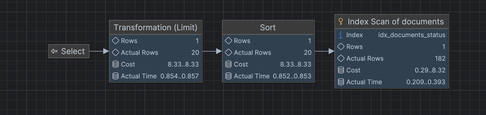

# EXPLAIN.md

## Анализ производительности поискового запроса

**Размер датасета, использованного для анализа:** ~196 049 документов.

В рамках тестового задания был проанализирован один из типичных поисковых запросов к API.

### Пример HTTP-запроса

```
http://localhost:8080/api/documents?size=20&page=0&sort=title,ASC&sort=updatedAt,desc&status=SUBMITTED&author=testIndxs
```

Этот запрос выполняет:

* фильтрацию по статусу документа
* фильтрацию по автору
* сортировку по названию и дате обновления
* постраничную выдачу результатов

---

# SQL-запрос

```sql
EXPLAIN ANALYZE
SELECT
    d.id,
    d.author,
    d.created_at,
    d.number,
    d.status,
    d.title,
    d.updated_at,
    d.version
FROM documents d
WHERE d.status = 'SUBMITTED'
  AND lower(d.author) LIKE '%testindxs%'
ORDER BY
    d.title ASC,
    d.updated_at DESC
OFFSET 0
LIMIT 20;
```

Визуализация плана выполнения:



---

# План выполнения запроса

```
Limit  (cost=8.33..8.33 rows=1 width=102) (actual time=1.238..1.242 rows=20 loops=1)
->  Sort  (cost=8.33..8.33 rows=1 width=102) (actual time=1.232..1.234 rows=20 loops=1)
        Sort Key: title, updated_at DESC
        Sort Method: top-N heapsort  Memory: 28kB
->  Index Scan using idx_documents_status on documents d
        (cost=0.29..8.32 rows=1 width=102)
        (actual time=0.230..0.416 rows=182 loops=1)
        Index Cond: (status = 'SUBMITTED'::document_status)
        Filter: (lower((author)::text) ~~ '%testindxs%'::text)

Planning Time: 0.768 ms
Execution Time: 1.430 ms
```

---

# Анализ плана выполнения

### Использование индекса

Планировщик PostgreSQL выбрал **Index Scan** по индексу:

```
idx_documents_status
```

Это позволило быстро ограничить выборку только документами со статусом `SUBMITTED`.

В результате вместо сканирования всей таблицы (~196 000 строк) база данных сразу сократила выборку до **182 релевантных записей**, после чего выполнила остальные операции.

Таким образом удалось избежать **Full Table Scan**, что значительно снижает нагрузку на систему.

---

### Фильтрация по автору

Фильтрация выполняется по условию:

```
LOWER(author) LIKE '%testindxs%'
```

Данный фильтр применяется **после использования индекса по статусу**.
Так как набор данных уже уменьшен до небольшого количества строк, вычисление `LIKE` выполняется быстро и не оказывает заметного влияния на время выполнения запроса.


---

### Сортировка и LIMIT

Сортировка выполняется по полям:

```
title ASC,
updated_at DESC
```

PostgreSQL использует алгоритм **top-N heapsort**, который оптимизирован для запросов с `LIMIT`.

Потому что хранится в памяти только необходимое количество строк (в данном случае 20), 
сортировка выполняется быстро и использует минимальный объём памяти.

Фактическое использование памяти:

```
28 kB
```

---

### Итоговая производительность

Общее время выполнения запроса:

```
~1.43 ms
```

Как по мне для **около 200 000 записей** — это ок.

---

# Пояснение по индексам

В условии тестового задания указаны фильтры, которые используются при поиске документов:

```
статус
автор
период дат
```

Исходя из этого были мной спроектированы индексы для таблиц.

---

## Индексы таблицы documents

### Индекс по статусу

```sql
idx_documents_status ON documents (status);
```

Используется для быстрого поиска документов по статусу.
Этот индекс активно используется как в поисковом API, так и в фоновых воркерах обработки документов.

---

### Индекс по дате создания

```sql
idx_documents_created_at ON documents (created_at);
```

Позволяет эффективно выполнять фильтрацию по периоду дат.

---

### Функциональный индекс по автору

```sql
idx_documents_author_lower ON documents (LOWER(author));
```

Данный индекс позволяет оптимизировать **регистронезависимый поиск по автору**.

---

## Индекс таблицы истории документов

```sql
idx_history_document_created ON document_history (document_id, created_at);
```

Этот индекс используется при загрузке истории документа.

Хотя приложение напрямую не выполняет запросы к таблице истории, Hibernate вроде как выполняет `JOIN` при использовании `EntityGraph`. 
В таком случае PostgreSQL ищет все записи истории по `document_id`.

Наличие индекса позволяет избежать полного сканирования таблицы истории и значительно ускоряет такие операции. 

---

# Стратегия индексирования

При проектировании схемы базы данных я намеренно **не добавлял большое количество составных индексов**.

В типичном сценарии использования поисковые фильтры применяются:

* по одному
* либо в простых комбинациях

Я не стал добавлять много индексов, потому что это может привести к:

* увеличению времени записи
* увеличению нагрузки на обновление индексов
* росту объёма хранения данных

При этом реальный выигрыш в производительности может быть минимальным, так как не факт, что пользователи будут регулярно использовать одинаковые комбинации фильтров.

PostgreSQL обладает достаточно умным планировщиком запросов и умеет эффективно работать с простыми индексами, комбинируя их при необходимости.

Поэтому было принято решение использовать **небольшое количество целевых индексов**, которые покрывают основные сценарии использования системы.

---

# Вывод

Как мне кажется, текущая структура индексов обеспечивает хорошую производительность системы при объёме данных около **200 000 документов**.