# Document Service Project

Многомодульный Maven-проект для управления документами с API-сервисом и CLI-утилитой для генерации документов.

## Структура проекта

```
document-service-parent
├── pom.xml (parent)
├── document-service-core (Spring Boot API)
└── document-generator (CLI утилита)
```

## Модули

### document-service-core

Spring Boot приложение с REST API для управления документами.

**Возможности:**

- REST API для CRUD операций с документами
- Валидация документов
- Многопоточная обработка документов (SUBMIT, APPROVE)
- Интеграция с базой данных через JPA
- Миграции Liquibase
- Swagger документация
- Логирование процесса

*В поиске — даты, используемые в периоде — это даты создания документа.

### document-generator

CLI-утилита для массовой генерации документов через API.

**Возможности:**

- Чтение параметров из конфигурационного файла
- Многопоточная генерация документов (количество потоков подбирается динамически)
  
- HTTP-запросы к API сервиса
- Логирование процесса

---

# Быстрый старт

## Поднятие инстанса в Docker

Первым делом необходимо поднять инстанс PostgreSQL.

В IntelliJ IDEA нужно перейти в корень проекта (терминал находится в корне по умолчанию) и выполнить команду:

```bash
docker-compose up -d
```

Инстанс PostgreSQL поднимется в фоновом режиме.

---

## Подключение к БД

Если вы предпочитаете работать с БД через терминал (а не через GUI, например DBeaver), можно подключиться следующим
образом:

```bash
docker exec -it itq_postgres psql -U itq_user -d itq_db
```

---

## Сборка проекта

Оставаясь в корне проекта, выполните:

```bash
mvn clean package
```

Если Maven не установлен локально, можно использовать wrapper:

```bash
./mvnw clean install
```

Это позволит собрать основной модуль и утилиту.

---

### Сборка через IntelliJ IDEA

Если предпочитаете использовать возможности IntelliJ IDEA:

1. В правом верхнем окне кликните по меню конфигураций  
   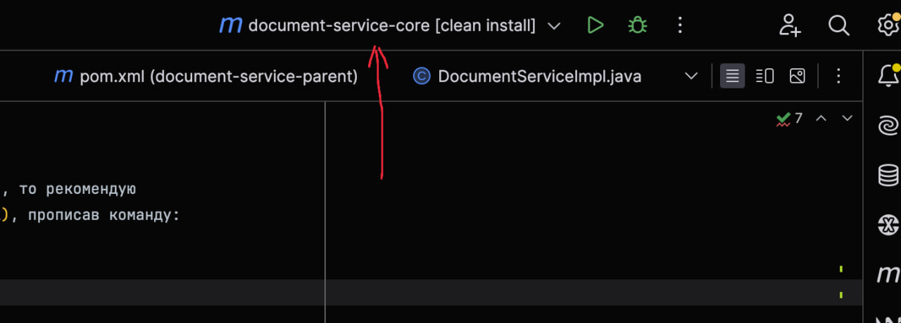

2. Выберите **Edit Configurations**  
   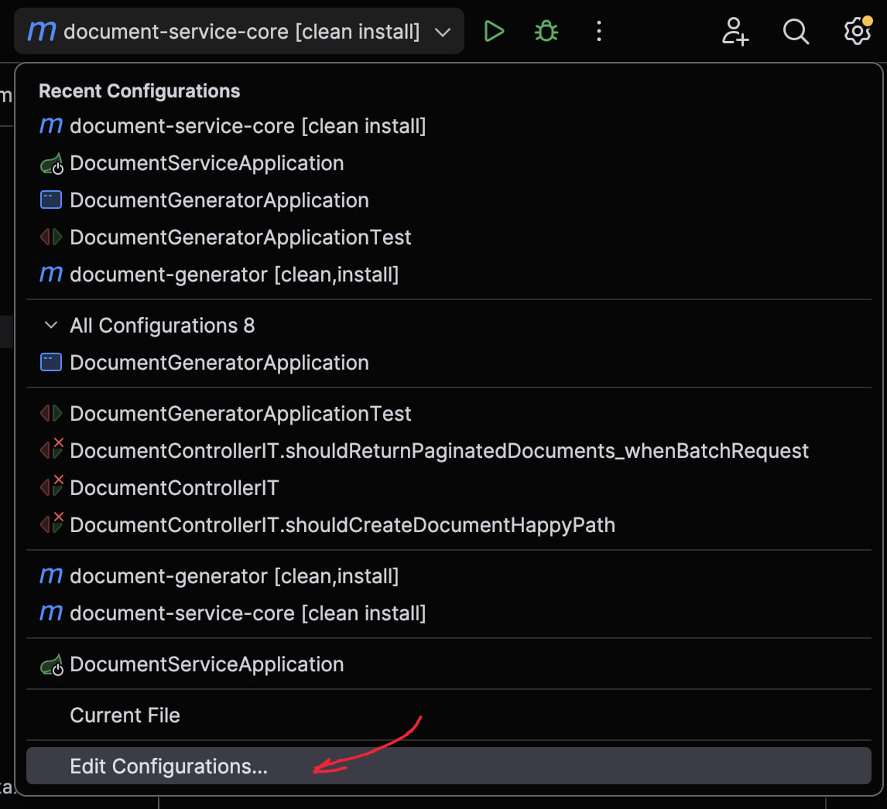

3. Нажмите **"+"**  
   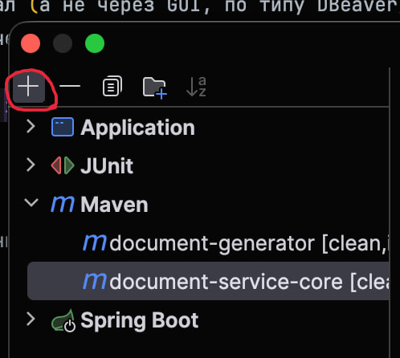

4. Выберите **Maven**  
   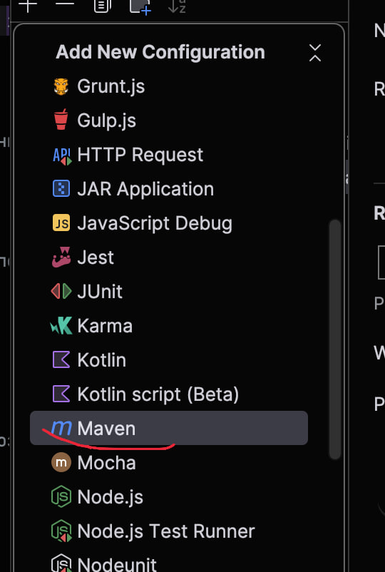

5. Заполните поля как на скриншоте  
   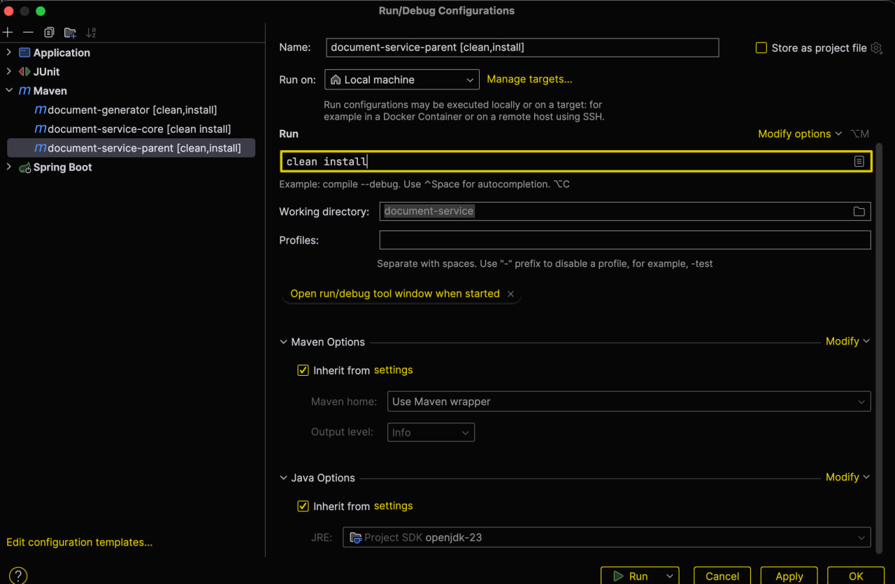

6. Нажмите **OK** и запустите сборку через кнопку запуска  
   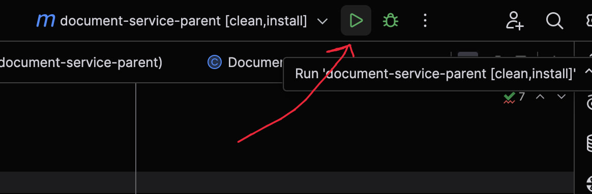

---

# Запуск core-сервиса

Для проверки основного функционала необходимо запустить Spring Boot сервис.

Перейдите в модуль:

```bash
cd document-service-core
```

И выполните:

```bash
mvn spring-boot:run
```

Если порт **8080** занят, можно указать другой порт:

```bash
mvn spring-boot:run -Dspring-boot.run.arguments="--server.port=9090"
```

Где 9090 — это Ваш порт.
После запуска API будет доступен по адресу:

```
http://localhost:8080
```

или на указанном вами порту.

---

## Swagger

Swagger доступен по адресу:

```
http://localhost:8080/swagger-ui/index.html
```

(или на вашем кастомном порту)

Swagger протестирован не полностью, но основная часть методов точно работает.

---

## Запуск через IntelliJ IDEA

Также можно запустить сервис через конфигурации IntelliJ IDEA.

1. Откройте **Edit Configurations**  
   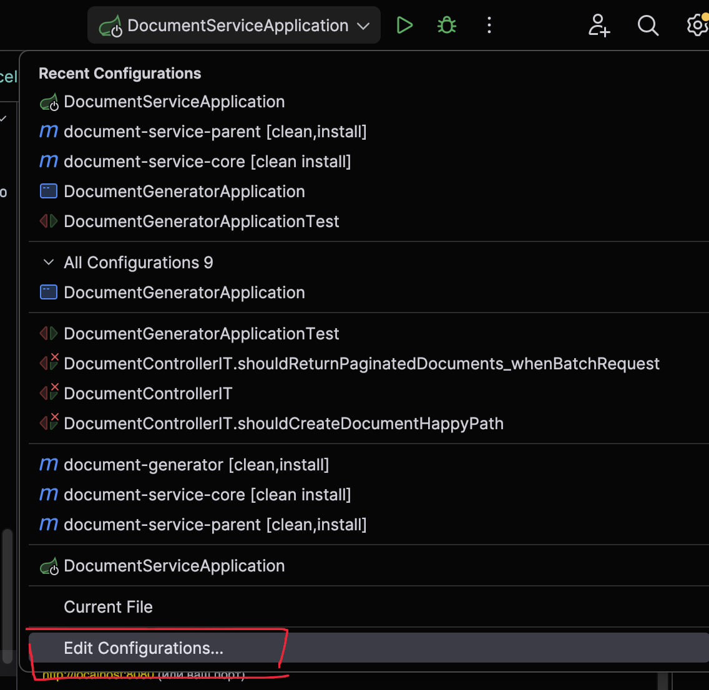

2. Добавьте конфигурацию **Spring Boot**  
   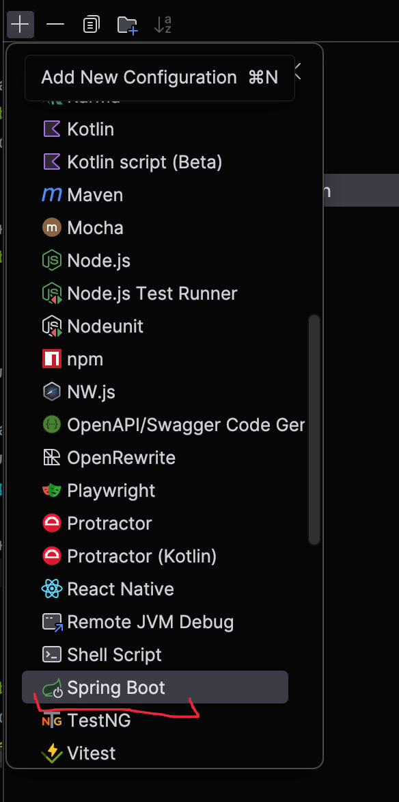

3. При необходимости настройте кастомный порт  
   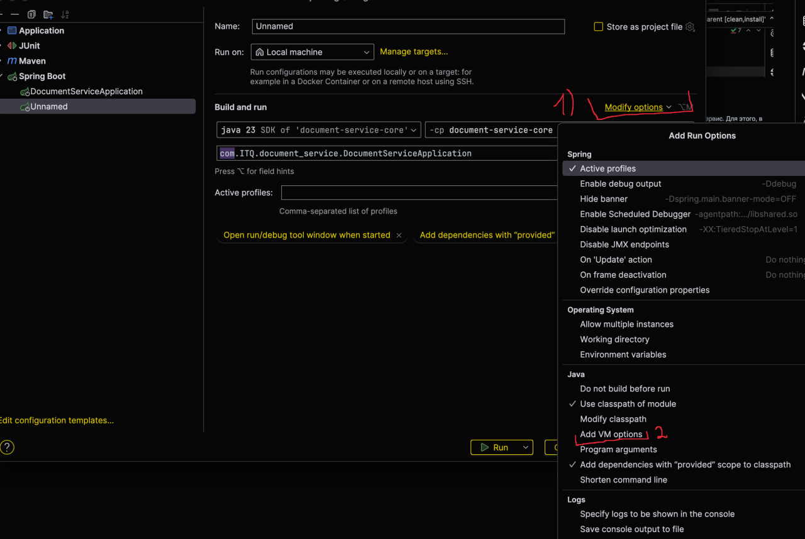

4. В поле VM Options укажите:
   ```
   -Dserver.port=9090
   ```
   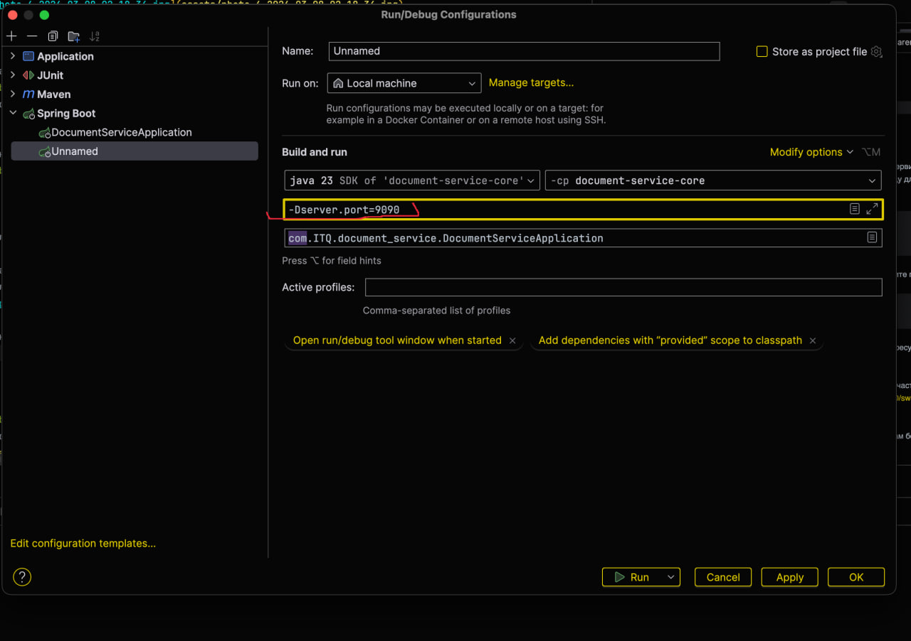
5. Нажмите **OK** и запустите приложение через кнопку запуска

---

# Запуск генератора документов

Если вы находитесь в корне проекта:

```bash
cd document-generator
```

### С конфигурацией по умолчанию

```bash
java -jar target/document-generator-0.0.1-SNAPSHOT-jar-with-dependencies.jar
```

### С кастомным конфигурационным файлом

```bash
java -jar target/document-generator-0.0.1-SNAPSHOT-jar-with-dependencies.jar custom-config.properties
```

*Рекомендуется размещать кастомный конфиг рядом с `config.properties`.  
После добавления файла потребуется пересобрать утилиту.

---

### Запуск через IntelliJ IDEA

Можно просто запустить **main-метод** через кнопку запуска🙂

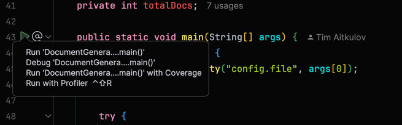

---

# Логирование

## Основной сервис

В текущей версии проекта настроено базовое логирование.

При необходимости можно включить более детальный уровень (`debug`) в конфигурации, ну и раскомментить строки в конфиге.

После успешного запуска сервиса должен появиться следующий лог:

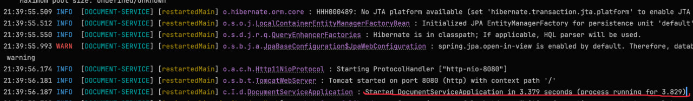

Если после этого приложение продолжает работать без ошибок — запуск прошёл успешно.

---

## Система маркеров логирования

Для удобства добавлена система маркеров.  
ENUM `OperationForLogType` предоставляет типы операций для логирования.

Они используются как **префикс** для каждого лога.

Пример для создания документа:

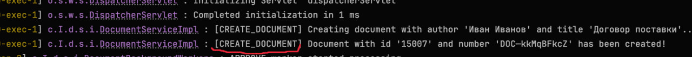

Пример для утверждения:

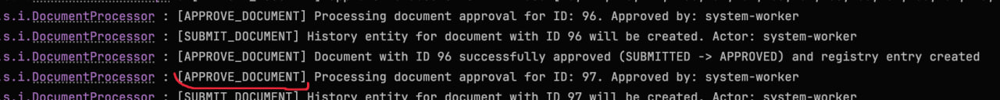

Формат логов примерно следующий:

```
Время → Уровень → [Сервис] → [Поток] → Класс → [Маркер] → Сообщение
```

---

## Логи batch-операций

Прогресс обработки пачек логируется двумя типами сообщений:


**Первый тип логов** — информация о том, какой документ обрабатывается, что происходит при обработке.

**Второй тип логов** — информация о прогрессе обработки пачки.

Метки доступны для основных операций:

- создание
- получение
- утверждение
- согласование
- поиск

Для фоновых операций отдельные метки отсутствуют (само фоновое
утверждение/согласование используют общий функционал, поэтому уже в самом процессе обработки логи будут с метками).

---

# Логирование утилиты

Утилита имеет ограниченный набор логов.  
При необходимости его можно расширить, включив уровень `debug` в конфигурации logback.

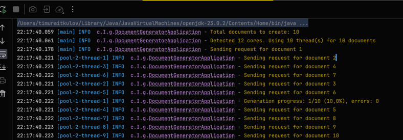

Отслеживать обработку документов можно по:

- логам отправки запросов
- логам прогресса

Первый лог всегда показывает количество документов для создания:

```
22:17:40.059 [main] INFO  c.I.g.DocumentGeneratorApplication - Total documents to create: 10
```

Предпоследний лог — итог обработки:

```
01:51:59.186 [main] INFO  c.I.g.DocumentGeneratorApplication - Generation completed.
 90000/90000 docs has been generated. Errors: 0. Time spent: 19,721 seconds
```

P.S. В логах не выводятся месяц и год — для тестовой задачи это смысла много не несет, а логи выглядят чище.

---

# Конфигурация генератора

Файл `config.properties` в модуле `document-generator`:

```properties
document.count=50
api.url=http://localhost:8080/api/documents
...
```

---

# Технологии

- Java 21
- Spring Boot 4.0.3
- Maven
- PostgreSQL
- Liquibase
- MapStruct
- Lombok
- OpenAPI
- Apache HttpClient
- JUnit 5
- TestContainers

---

# Дополнительно

ER-диаграмма:

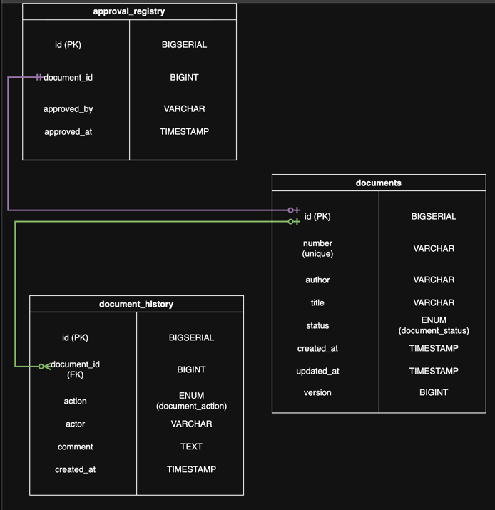

```
Что бы вы поменяли, чтобы обработка одного запроса уверенно работала с
5000+ id?
```

Ответ: думаю, пришлось бы немного подкрутить настройки documentSubmitOrApproveExecutor. Увеличить очередь,
вероятно добавил бы немного потков. Также по валидации моменты нужно было бы поменять,
чтобы принимать больший размер списков.
Сделал бы чанки для работы в многопоточном режиме, чтобы очередь задач не грузить.

```
Как бы вы вынесли реестр утверждений в отдельную систему (отдельная БД или
отдельный HTTP-сервис)?
```

Ответ:

1. Новый сервис и API
   Создаем отдельный Spring Boot проект со своей БД (отдельный микросервис). Там будет таблица `approval_registry` и
   эндпоинт
   В него будем передавать `documentId`, кто подтвердил и когда и др.
   И накидываем валидацию на вход, чтобы битые данные не засоряли реестр.

2. Интеграция и «атомарность»
   В основном сервисе (`document-service`) выкидываем старую сущность и репозиторий реестра. В `DocumentProcessor`
   вместо прямого `save()` в базу будем стучаться в новый сервис.

Ну и нам нужно откатить аппрув, если реестр не ответил. Я бы сделал это так:

* Оборачиваем метод аппрува в `@Transactional`.
* Сначала обновляем статус документа у себя.
* Потом делаем синхронный вызов к реестру.
* Если оттуда летит 4xx/5xx или таймаут, то пробрасываем исключение. Spring увидит это
  и сам откатит транзакцию в базе документов. В итоге документ не станет `APPROVED`, если запись в реестре не создалась.

3. Отказоустойчивость

Прикручиваем ретраи (через тот же `Resilience4j`).
Если реестр временно недоступен, попробуем еще пару раз. Но если совсем глухо — валим всё и возвращаем `REGISTRY_ERROR`.

*Это максимально поверхностно и концептуально)
